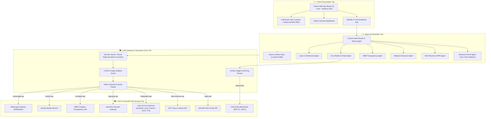
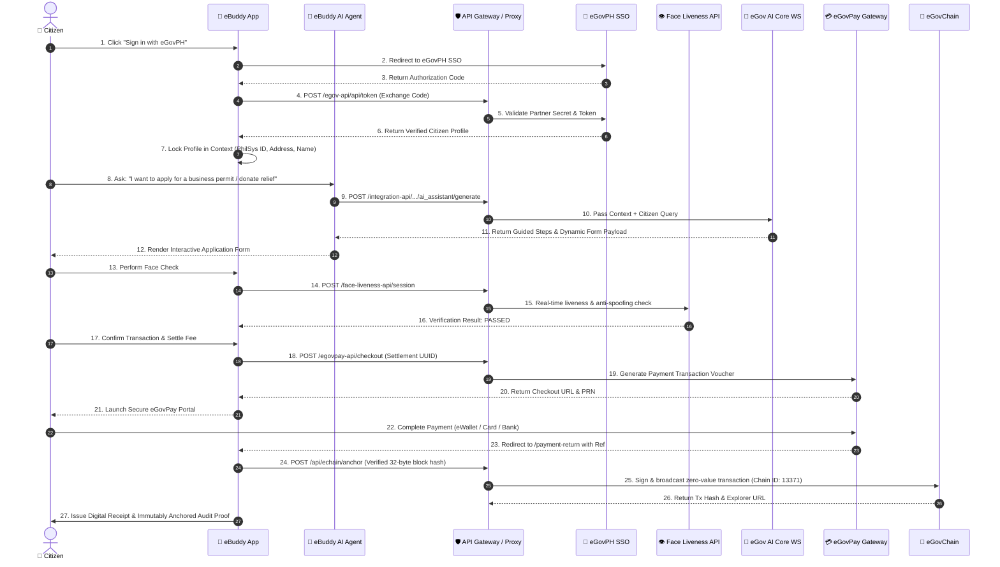

# 🤖 eBuddy — AI-Powered Digital Citizen Portal

<div align="center">

[](https://e.gov.ph)
[](https://developer.e.gov.ph)
[](https://hackathon-blockchain.e.gov.ph)
[](https://react.dev)
[](https://www.typescriptlang.org)
[](https://tailwindcss.com)
[](https://vitejs.dev)
[](LICENSE)

**A next-generation, accessible digital citizen portal bridging Filipino citizens and government services through interactive AI assistance, unified authentication, blockchain-anchored auditability, and seamless payment processing.**

[Features](#-key-features) • [System Architecture](#-system-documentation--architecture) • [API Integrations](#-egov-api-integration-points) • [eGovChain Anchoring](#-egovchain-donation-anchoring) • [Getting Started](#-getting-started) • [Configuration](#-environment-configuration) • [Project Structure](#-project-structure)

</div>

---

## 🏛️ Problem Statement & Overview

Navigating government processes in the Philippines often involves fragmented agency portals, long physical queues, confusing multi-step workflows, and manual document validation.

**eBuddy** addresses this challenge by providing an all-in-one conversational AI and digital citizen dashboard. Powered by official **DICT and eGovPH APIs**, eBuddy enables citizens to discover, apply for, verify, and settle government transactions in minutes—all in one secure, accessible, mobile-first experience.

---

## ✨ Key Features

### 🤖 Multi-Agent AI Citizen Assistant
- **Domain-Specific AI Workflows:** Guided sub-agents for Business Permits (LGU Trece Martires), Social Security System (SSS), LTO Driver's License Renewal, and Legal Inquiries.
- **Natural Language Understanding:** Query municipal records, procedures, fees, and requirements in conversational English or Tagalog.
- **Interactive Action Widgets:** Generates dynamic forms, fee calculators, PRN payment vouchers, and direct deep links right within the chat flow.

### 🔐 eGovPH Single Sign-On (SSO) & Identity
- **Seamless OAuth Authentication:** Secure token exchange with eGovPH partner authorization.
- **Profile Locking & Syncing:** Automatically imports and locks verified citizen profile data (PhilSys ID, address, contact) to prevent spoofing and data tampering.
- **Session Management:** Encrypted token handling with automatic session expiry.

### 👁️ Face Liveness & Anti-Spoofing Biometrics
- **In-Browser Biometric Checks:** Real-time webcam face liveness detection integrated via the official DICT / eVerify Face Liveness API.
- **Anti-Fraud Guard:** Protects high-security transactions (e.g. SSS record verification, permit issuance) from photo-replay and identity spoof attacks.

### 💳 eGovPay Digital Gateway Integration
- **Dynamic Fee Settlements:** Real-time checkout creation for municipal fees, tax assessments, and official clearances.
- **Donation Settlement Templates:** Direct civic contributions to verified disaster relief and emergency campaigns.
- **Payment Lifecycle Callbacks:** Automated transaction verification and digital receipt generation.

### 🔗 eGovChain Blockchain Ledger Anchoring
- **Tamper-Proof Auditability:** Confirmed civic and disaster relief donations are hashed (SHA-256) and anchored immutably to DICT's **eGovChain** (`Chain ID: 13371`).
- **Privacy-Preserving Proofs:** Uses zero-value transactions containing only 32-byte cryptographic hashes without leaking personal PII or donation amounts on-chain.

### 📊 DBM Budget Transparency (Compass API)
- **Live National & Local Budget Oversight:** Live querying of SAAODB, NCA, SARO, and LGSF budget allocations.
- **Civic Accountability:** Citizens can ask eBuddy about public expenditure, barangay allocations, and local infrastructure projects.

### 🚨 eReport Civic Grievance & Emergency Reporting
- **Geotagged Incident Reporting:** Rapid reporting for road hazards, waste management, public safety, and infrastructure damage.
- **Case Tracking:** Track status updates from intake to municipal resolution.

### 🌐 Multilingual & Inclusive Accessibility
- **eGov Translator:** Live translation and transliteration between Tagalog/Filipino, regional dialects, and English.
- **Document Extractor (OCR):** Ingests uploaded IDs and documents to auto-populate application forms.
- **Speech Maker:** Text-to-speech audio synthesis and voice-guided interactions for enhanced accessibility.

---

## 🏛️ System Documentation & Architecture

For detailed architectural specifications, refer to [docs/SYSTEM_ARCHITECTURE.md](docs/SYSTEM_ARCHITECTURE.md).

### 1. High-Level Architecture Diagram

The system operates across four interconnected tiers:



---

### 2. End-to-End System Flow & Transaction Sequence

The sequence diagram below details the end-to-end integration flow between the citizen, eBuddy's AI agents, official eGov APIs, and eGovChain blockchain ledger:



---

## 🔌 eGov API Integration Points

All external eGovPH endpoints are securely proxied to eliminate CORS barriers and protect secret tokens:

| Local Proxy Path | Remote Target Endpoint | Protocol | Purpose & Integration Scope |
| :--- | :--- | :---: | :--- |
| `/egov-api` | `https://hackathon-sso.e.gov.ph` | `HTTPS` | **eGovPH Single Sign-On:** Authorization code exchange, partner token validation, verified citizen profile sync. |
| `/face-liveness-api` | `https://hackathon-face-liveness-api.e.gov.ph` | `HTTPS` | **DICT Face Liveness API:** In-browser active anti-spoofing and biometric face validation. |
| `/integration-api` | `https://egov-ai-core-ws.oueg.info` | `HTTPS` | **eGov AI Core Services:**<br>• `/ai_assistant/generate`: Contextual citizen assistance.<br>• `/laws_and_regulations/generate`: Legal and ordinance retrieval.<br>• `/tourism/generate`: Travel and cultural guides.<br>• `/translator/generate`: Filipino transliteration.<br>• `/document_extractor/generate`: ID OCR processing.<br>• `/speech_maker/generate`: Text-to-speech audio synthesis.<br>• `/credits`: Real-time API credit allowance monitoring. |
| `/egovpay-api` | `https://egovpay-pgi-ws-dev.oueg.info` | `HTTPS` | **eGovPay Gateway:** Settlement template routing, transaction creation, PRN voucher generation, and payment callbacks. |
| `/api/echain/*` | `https://hackathon-blockchain.e.gov.ph` | `JSON-RPC` | **eGovChain (Chain ID 13371):** Privacy-preserving cryptographic anchoring of verified payment confirmation hashes. |
| `/compass-api` | `https://dbm-ws.oueg.info` | `HTTPS` | **DBM Budget Transparency (Compass):** Real-time SAAODB, NCA, SARO, and LGSF budget expenditure records. |
| `/everify-api` | `https://hackathon-everify-api.e.gov.ph` | `HTTPS` | **eVerify PhilSys Service:** Direct verification against the Philippine National ID registry. |
| `/emessage-api` | `https://ws-message.e.gov.ph` | `HTTPS` | **eMessage Gateway:** SMS transaction receipts and critical citizen broadcast notifications. |

---

## 🔗 eGovChain Donation Anchoring

Paid donations retain their full append-only SHA-256 ledger in the client session. After the eGovPay API verifies `PAID` or `SUCCESS`, the server re-verifies the payment and sends only the 32-byte confirmation-block hash to **eGovChain** in a signed, zero-value transaction. Donor identity, campaign details, dedication, and payment details are **never** placed in the transaction input, preserving strict citizen privacy.

1. Confirm with the eGovChain administrator that a self-generated signer is allowed on chain ID `13371`.
2. Generate a dedicated prototype signer locally:
   ```bash
   npm run echain:generate-wallet
   ```
   *The command writes the private key to ignored `.env.local` without printing it.*

3. Copy server-only variables to Vercel Project Settings → Environment Variables:
   ```env
   ECHAIN_RPC_URL=https://hackathon-blockchain.e.gov.ph
   ECHAIN_EXPLORER_URL=https://hackathon-explorer.e.gov.ph
   ECHAIN_EXPLORER_TX_URL_TEMPLATE=https://hackathon-explorer.e.gov.ph/tx/{txHash}
   ECHAIN_CHAIN_ID=13371
   ECHAIN_PRIVATE_KEY=0x...
   EGOVPAY_API_KEY=test_...
   EGOVPAY_API_URL=https://egovpay-pgi-ws-dev.oueg.info
   ```

4. During local development, `npm run dev` exposes equivalent `/api/echain/*` middleware on the Vite server. Production utilizes Vercel Serverless Functions.

---

## 🚀 Getting Started

### Prerequisites
- **Node.js** 18.0 or higher
- **npm** 9.0+ (or **pnpm** / **yarn**)

### 1. Clone the Repository
```bash
git clone https://github.com/hiroqt/eGovAI.git
cd eGovAI
```

### 2. Install Dependencies
```bash
npm install
```

### 3. Configure Environment Variables
Copy `.env.example` to `.env` and fill in your developer portal credentials:
```bash
cp .env.example .env
```

### 4. Run Development Server
```bash
npm run dev
```
Open your browser and navigate to `http://localhost:5173`.

---

## ⚙️ Environment Configuration

Create a `.env` file in the project root:

```env
# Application Base URL
VITE_APP_BASE_URL=http://localhost:5173

# eGovPH SSO Configuration
VITE_EGOV_SSO_URL=https://hackathon-sso.e.gov.ph
VITE_API_BASE_URL=http://localhost:5173/api

# eGovPH Partner Credentials (Hackathon)
VITE_EGOV_PARTNER_CODE=HACKATHON_SSO
VITE_EGOV_PARTNER_SECRET=your_partner_secret_here

# Face Liveness API Configuration (Proxied to avoid CORS)
VITE_FACE_LIVENESS_URL=/face-liveness-api
VITE_FACE_LIVENESS_API_KEY=your_face_liveness_api_key

# eGovPH AI Core Integration API
VITE_EGOV_INTEGRATION_BASE_URL=https://egov-ai-core-ws.oueg.info
VITE_EGOV_ACCESS_CODE=your_access_code_here

# eGovPay Development Gateway
VITE_EGOVPAY_API_KEY=test_your_egovpay_api_key_here
VITE_EGOVPAY_SETTLEMENT_UUID=your_settlement_template_uuid_here
VITE_SSS_RECORD_VERIFICATION_FEE=1

# eGovChain Configuration
VITE_ECHAIN_ANCHORING_ENABLED=true
VITE_ECHAIN_API_BASE=/api/echain
ECHAIN_RPC_URL=https://hackathon-blockchain.e.gov.ph
ECHAIN_EXPLORER_URL=https://hackathon-explorer.e.gov.ph
ECHAIN_EXPLORER_TX_URL_TEMPLATE=https://hackathon-explorer.e.gov.ph/tx/{txHash}
ECHAIN_CHAIN_ID=13371

# DBM Transparency Portal (Compass API)
VITE_COMPASS_API_KEY=your_compass_api_key_here

# Environment Mode
NODE_ENV=development
```

---

## 📂 Project Structure

```
eGovAI/
├── api/                        # Serverless API routes (eChain anchoring)
│   └── echain/                 # eGovChain anchor & status functions
├── public/                     # Static assets & icons
├── docs/                       # Architectural & SSO documentation
│   ├── SYSTEM_ARCHITECTURE.md  # Comprehensive system architecture document
│   └── EGOV_SSO_INTEGRATION.md # Detailed SSO protocol documentation
├── scripts/                    # Utility scripts (wallet generation)
├── server/                     # Local development mock & middleware servers
├── src/
│   ├── components/             # Reusable UI & Widget components
│   │   ├── AppLayout.tsx       # Main navigation layout
│   │   ├── BottomNav.tsx       # Mobile navigation dock
│   │   ├── Header.tsx          # App bar with user status & quick links
│   │   ├── EBuddyMascot.tsx    # Official eBuddy Mascot animations
│   │   ├── EGovSignInForm.tsx  # SSO authentication component
│   │   └── ProtectedRoute.tsx  # Auth guard wrapper
│   ├── config/                 # App configuration & endpoints
│   │   └── egov.config.ts      # eGov SSO and base URL settings
│   ├── context/                # Global state providers
│   │   └── AuthContext.tsx     # Citizen auth & session state
│   ├── pages/                  # Application views & route handlers
│   │   ├── AIChatHome.tsx      # Main eBuddy AI conversational engine
│   │   ├── Dashboard.tsx       # Citizen services hub
│   │   ├── WelcomePage.tsx     # Landing & SSO entry page
│   │   ├── SSOCallbackPage.tsx # OAuth code exchange handler
│   │   ├── FaceLivenessPage.tsx# Biometric anti-spoofing camera check
│   │   ├── BusinessServicesPage.tsx # LGU Trece Martires Business Permits
│   │   ├── SSSServicesPage.tsx # SSS records, PRN & contribution tools
│   │   ├── DriversLicenseRenewalPage.tsx # LTO license renewal prep
│   │   ├── EReportPage.tsx     # Civic incident & grievance reporting
│   │   ├── DonationsPage.tsx   # Verified disaster relief donations & blockchain proofs
│   │   ├── LawsPage.tsx        # Legal & regulatory inquiry page
│   │   ├── PaymentPage.tsx     # eGovPay checkout screen
│   │   ├── PaymentReturnPage.tsx # Payment callback & receipt screen
│   │   ├── ActivityPage.tsx    # Citizen application history
│   │   ├── NotificationsPage.tsx # Push alerts & status updates
│   │   └── ProfilePage.tsx     # Verified citizen profile
│   ├── services/               # eGov API & AI agent service clients
│   │   ├── aiBusinessPermitAgentService.ts # Business permit AI logic
│   │   ├── aiSSSAgentService.ts            # SSS AI agent logic
│   │   ├── aiEReportAgentService.ts        # Civic incident reporting AI
│   │   ├── aiTransparencyService.ts        # DBM Compass budget AI logic
│   │   ├── aiDonationAgentService.ts       # Civic donation AI logic
│   │   ├── eChainService.ts                # eGovChain blockchain client
│   │   ├── egovService.ts                  # eGov AI Core WS integration
│   │   ├── eGovAuthService.ts              # SSO auth service
│   │   ├── eGovPayService.ts               # eGovPay gateway client
│   │   ├── dbmTransparencyService.ts       # DBM budget data service
│   │   ├── faceLivenessService.ts          # Face liveness verification
│   │   └── eVerifyService.ts               # PhilSys identity verification
│   ├── types/                  # TypeScript interface definitions
│   ├── App.tsx                 # Route declarations & provider setup
│   ├── main.tsx                # React entry point
│   └── index.css               # Design system & Tailwind styling
├── package.json
├── tailwind.config.js
├── vite.config.ts
└── README.md
```

---

## 🛠️ Available Scripts

| Command | Description |
| :--- | :--- |
| `npm run dev` | Starts local development server at `http://localhost:5173` |
| `npm run echain:generate-wallet` | Creates a dedicated test-only eGovChain signer in `.env.local` |
| `npm run build` | Compiles TypeScript and builds production bundle in `dist/` |
| `npm run preview` | Previews the production build locally |
| `npm run test` | Runs the test suite via Vitest |
| `npm run lint` | Checks codebase for linting errors |

---

## 📹 Hackathon Demonstration & Video

- **Live Presentation Video:** [YouTube Video Demonstration *(Unlisted/Public)*](#) *(Insert YouTube Link)*
- **Source Code Repository:** [GitHub - hiroqt/eGovAI](https://github.com/hiroqt/eGovAI)

---

## 👥 Team & Authors

- **Primary Developer & Contact:** Arnel Baylon
- **Project:** eBuddy (eGovHackathon 2026 Submission)

---

## 📄 License

This project is licensed under the [MIT License](LICENSE).
