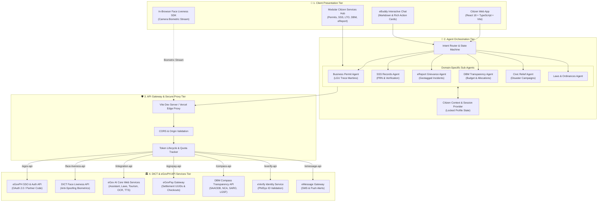
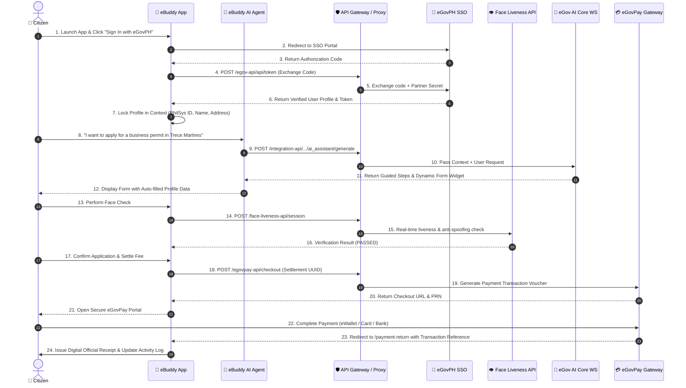

# 🏛️ eBuddy System Architecture & API Integration Documentation

## Executive Summary

**eBuddy** is an AI-powered, multi-agent digital citizen portal engineered to unify and streamline public service delivery in the Philippines. Designed for integration with the Department of Information and Communications Technology (**DICT**) and **eGovPH** ecosystem, eBuddy orchestrates authentication, biometric verification, artificial intelligence, payments, and open budget transparency into a single citizen-centric platform.

---

## 1. High-Level System Architecture

The system is structured into four cohesive layers designed for high security, scalability, and loose coupling:

---

## 2. End-to-End Citizen Transaction Flow

Below is the sequence diagram illustrating how eBuddy orchestrates multiple DICT APIs for a typical end-to-end citizen service (e.g. Business Permit or SSS verification with biometric check and payment):

---

## 3. Detailed eGov API Integration Touchpoints

| Gateway Proxy Path | Remote Host Endpoint | Protocol | Purpose & Data Scope |
| :--- | :--- | :---: | :--- |
| `/egov-api` | `https://hackathon-sso.e.gov.ph` | `HTTPS` | **eGovPH Single Sign-On:** Exchanges authorization codes for citizen tokens; fetches verified personal records (Name, Birthdate, Address, PhilSys ID). |
| `/face-liveness-api` | `https://hackathon-face-liveness-api.e.gov.ph` | `HTTPS` | **DICT Biometric Face Liveness:** Provides active anti-spoofing and face verification for high-security transactions. |
| `/integration-api` | `https://egov-ai-core-ws.oueg.info` | `HTTPS` | **eGov AI Core Web Services:** • `/ai_assistant/generate`: Contextual citizen chat. • `/laws_and_regulations/generate`: Legal knowledge base. • `/tourism/generate`: Travel & cultural inquiries. • `/translator/generate`: Filipino transliteration. • `/document_extractor/generate`: ID OCR parsing. • `/speech_maker/generate`: Voice synthesis. • `/credits`: Real-time API allowance tracking. |
| `/egovpay-api` | `https://egovpay-pgi-ws-dev.oueg.info` | `HTTPS` | **eGovPay Gateway:** Settlement template routing, transaction creation, QRPh/PRN voucher generation, payment callbacks. |
| `/compass-api` | `https://dbm-ws.oueg.info` | `HTTPS` | **DBM Budget Transparency (Compass):** Queries live fiscal records (SAAODB, NCA, SARO, and LGSF allocations) for local and national expenditures. |
| `/everify-api` | `https://hackathon-everify-api.e.gov.ph` | `HTTPS` | **eVerify PhilSys Service:** Direct citizen verification against Philippine National ID registry. |
| `/emessage-api` | `https://ws-message.e.gov.ph` | `HTTPS` | **eMessage Notifications:** Dispatches SMS receipts, application progress updates, and civic alerts. |

---

## 4. Security, Privacy & Reliability Architecture

1. **Zero Client-Side Secret Leakage:**
   - Partner secrets and private credentials are never exposed directly to the public web browser. All requests are routed through the configured proxy gateway (`/egov-api`, `/integration-api`, `/face-liveness-api`, etc.).
2. **Ephemeral Biometric Frame Handling:**
   - The Face Liveness camera stream is evaluated strictly in-memory. No raw citizen video frames or biometric face encodings are stored persistently on the client or local database.
3. **Profile Integrity & Anti-Tampering:**
   - Citizen identity fields (Full Name, Address, PhilSys UniqID) are locked upon eGovPH SSO authentication and cannot be arbitrarily modified during transaction submissions.
4. **Resilient Rate-Limiting & Credit Monitoring:**
   - eBuddy continuously monitors token expiration and remaining credit counts via `/api/v1/egov/integration/credits`, providing graceful fallback and caching when API thresholds are approached.
